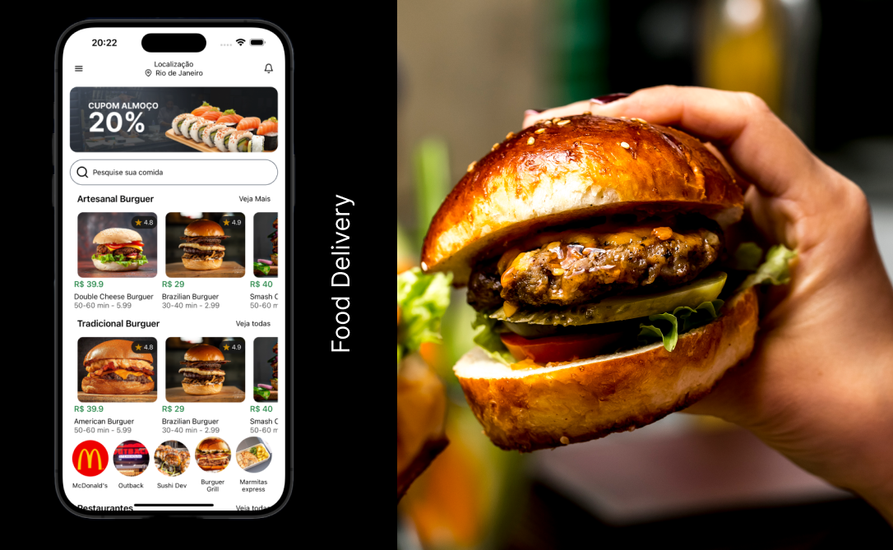

<h1 style='text-align:center'>Food Delivery - React Native | Front-end</h1>

<h2>Description</h2>

The main idea was create a front-end for a food delivery app. 
Using all facilities of Nativewind to better and easy customization to ensure responsive design.

Applying Json-Server Api to feel dynamically products and others libraries.

Enjoy

<h2>Documentation</h2>

- <a href="https://www.nativewind.dev/quick-starts/create-react-native-app">NativeWind</a>
- <a href="https://www.npmjs.com/package/json-server">Json-server</a>

<h2>Images & Inspiration</h2>

- <a href='https://www.freepik.com'>Freepik image bank</a>

<h3>Dev: Jorge Cruz<h3>